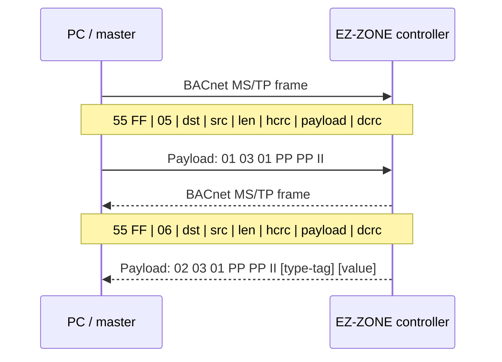
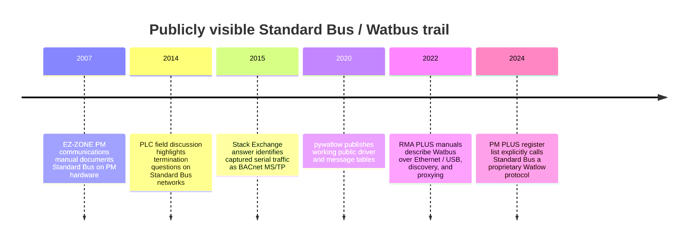

# Watlow Standard Bus Protocol Reference Survey

## Executive summary

The strongest evidence from the surveyed materials points to two related but not identical protocol families under the “Standard Bus” / “Watbus” names. In older low-speed serial products such as EZ-ZONE PM/ST/RUI systems, the wire image is best explained as **BACnet MS/TP framing over EIA-485 with a Watlow-proprietary application payload**. In newer products and literature, entity["company","Watlow","industrial controls us"] increasingly calls the same ecosystem **Watbus**, extends it over Ethernet and USB, and explicitly describes it as proprietary; official F4T documentation places Standard Bus on **TCP port 44819** rather than BACnet/IP. Official manuals document configuration, addressing, electrical wiring, parameter IDs, software hooks, gatewaying, and discovery behavior, but I did **not** locate a public official byte-level wire specification for the proprietary payload itself. citeturn8view3turn42search0turn30view2turn48view0

For the low-speed serial case, the reverse-engineering trail is unusually coherent. A 2015 reverse-engineering answer by entity["people","Jason Geffner","reverse engineer"] identifies the packet as BACnet MS/TP and supplies the CRC algorithms; the packet examples in `pywatlow` and `numat/watlow` line up with that framing; and the BACnet frame structure in entity["organization","ASHRAE","hvac standards us"] documentation resolves several bytes that community docs had previously labeled only as “zone” or “message type.” The result is a practical implementation picture that is good enough to build a read/write client for many EZ-ZONE devices, but still leaves portions of the inner payload semantics undocumented and partly inferred. citeturn20view0turn32view0turn19view0turn29view0

Official product literature further narrows the deployment details. On EZ-ZONE PM hardware, Standard Bus is the built-in communications mode, uses addresses **1–16**, and shares the EIA-485 physical port with Modbus RTU depending on model/options. Watlow wiring instructions specify daisy-chain wiring, optional termination, and a **maximum of 16 EZ-ZONE PM controllers on a Standard Bus segment**. Official converter white papers show PC-software operation at **38,400 baud, 8 data bits, no parity, 1 stop bit** for Standard Bus connections. Modern RMA PLUS literature adds Watbus-over-Ethernet, Watbus-over-USB, discovery, port mirroring, and proxy/gateway behavior to attached devices. citeturn24view4turn24view1turn40view1turn7view1turn30view0turn30view2

## Scope and assumptions

This report covers every materially relevant reference I could locate for the protocol itself or its practical analysis: official manuals, datasheets, register lists, software sheets, GitHub implementations, forum discussions, reverse-engineering writeups, gateway manuals, BACnet/Wireshark references needed to decode the framing layer, and the small number of academic and patent-adjacent hits that mentioned Standard Bus at all. When the original vendor asset was inaccessible in this session, I used mirrored copies that appear to contain the same Watlow document and marked them as such in the reference table. Patent searches produced only tangential material and no direct protocol disclosure. citeturn26search0turn26search5turn46search1

Assumptions are intentionally conservative. Anything not directly documented or corroborated across multiple independent sources is treated as **unknown** or as an **inference** rather than a fact. In particular, the inner Watlow payload grammar for low-speed serial Standard Bus is only partially understood from captured examples, and the packet grammar for high-speed Watbus / Standard Bus over Ethernet is **not** publicly documented in the sources I found. citeturn32view0turn34view0turn48view0

## Methodology

I prioritized official Watlow materials first: user manuals, communications manuals, product sheets, catalogs, software sheets, and register lists. I then cross-checked those against community reverse-engineering, two independent Python implementations hosted on entity["company","GitHub","software hosting us"], forum posts, and BACnet/Wireshark references to see whether the serial captures decomposed cleanly under BACnet MS/TP rules. Finally, I checked for patents and academic mentions to see whether anyone outside Watlow had published protocol details; those sources were sparse and largely operational rather than wire-level. citeturn8view3turn25view3turn20view0turn32view0turn19view0turn29view1turn46search0turn26search0

The most important analytical step was to **overlay the official BACnet MS/TP frame format onto the captured Watlow serial messages**. That resolves the outer frame with high confidence: preamble, frame type, destination address, source address, length, header CRC, payload, and data CRC. What remains proprietary is the payload inside the BACnet frame. citeturn29view0turn20view0turn32view0

## Findings

### Official-document picture

Watlow’s official EZ-ZONE materials consistently present Standard Bus as the built-in communications path for EZ-ZONE controllers and distinguish it from optional Modbus RTU. In the EZ-ZONE PM communications manual, dual-port configurations use **Port 1 = Standard Bus** and **Port 2 = Modbus**, with the Standard Bus side used for EZ-ZONE Configurator and firmware flashing. The PM user manual exposes the Standard Bus address parameter `[Ad;S]` with a valid range of **1 to 16**, while Modbus uses a separate address range up to 247. The same PM installation material specifies EIA-485 wiring, daisy-chaining, optional termination, a 4,000 ft maximum segment length, and a hard maximum of **16 EZ-ZONE PM controllers on a Standard Bus network**. citeturn25view3turn24view1turn24view4

The official software/docs picture also matches a parameter-ID-driven API rather than a published wire grammar. Watlow’s LabVIEW driver sheet says Standard Bus is included with EZ-ZONE products, that the driver exposes all EZ-ZONE parameters, and that those parameters are identified by the **parameter numbers printed in the product manuals**. The PM manual’s parameter pages explicitly label “Parameter ID” as the identifier used by software such as LabVIEW and show data types such as `float` and `uint` for values like Process Value (4001), Set Point (7001), and Heat Algorithm (8003). citeturn8view3turn35view0turn35view2turn35view3turn35view4

Modern Watlow literature makes the naming transition clearer. The PM PLUS register list explicitly says **Standard Bus is a Watlow proprietary protocol** used with Watlow software such as EZ-ZONE Configurator, Composer, and the Watlow Standard Bus driver for LabVIEW. Other recent Watlow materials equate the ecosystem with **Watbus**, saying all modules ship with the standard bus protocol (Watbus) and that RMA PLUS provides Watbus via serial, USB, and Ethernet. That is the clearest official evidence that “Standard Bus” and “Watbus” are the same family, even if the transport differs by product generation. citeturn42search0turn30view2

### Reverse-engineered low-speed serial protocol

The critical reverse-engineering result is that the **serial low-speed Standard Bus link layer matches BACnet MS/TP**. The Reverse Engineering Stack Exchange answer identifies the packet as BACnet MS/TP and gives the BACnet header-CRC and data-CRC algorithms. The BACnet frame format in the ASHRAE spec exactly matches the observed outer structure: `55 FF` preamble, one-byte frame type, one-byte destination address, one-byte source address, two-byte big-endian payload length, one-byte header CRC, payload, and two-byte CRC-16/CCITT transmitted little-endian. citeturn20view0turn29view0

That mapping is more rigorous than the community’s earlier provisional labels. For the canonical read sample `55 FF 05 10 00 00 06 E8 01 03 01 04 01 01 E3 99`, the bytes that older writeups treated as “zone” and “request type” instead parse cleanly as **destination MAC = `0x10`**, **source MAC = `0x00`**, **payload length = `0x0006`**, and **header CRC = `0xE8`** under BACnet MS/TP rules. The final bytes `E3 99` are the BACnet data CRC on the six-byte payload `01 03 01 04 01 01`. Because that exact outer breakdown works across multiple request/response examples, confidence in the BACnet framing layer is high. citeturn20view0turn29view0turn32view0turn34view0

A second strong inference comes from comparing the captured frames with the `pywatlow` parser. The PM manuals expose Standard Bus addresses **1–16**, yet the captured destination/source bytes for controllers are `0x10`, `0x11`, and so on. The `pywatlow` source subtracts **15** from the response address byte to recover the displayed controller address, which strongly suggests a mapping of **MS/TP MAC = 0x0F + Standard Bus address** for EZ-ZONE devices, with the host/master using **MAC 0x00**. I would treat that as a **well-supported inference**, not an official fact. citeturn24view1turn32view0turn16view0turn29view0

The inner Watlow payload appears structurally regular even though its full semantics remain undocumented. Across `pywatlow` examples, the payload families are:

- read request: `01 03 01 <param_hi> <param_lo> <instance>`
- float read response: `02 03 01 <param_hi> <param_lo> <instance> 08 <4-byte float>`
- integer/enum read response: `02 03 01 <param_hi> <param_lo> <instance> 0F 01 <2-byte value>`
- float write request/response: `01|02 04 <param_hi> <param_lo> <instance> 08 <4-byte float>`
- integer/enum write request/response: `01|02 04 <param_hi> <param_lo> <instance> 0F 01 <2-byte value>` citeturn33view0turn34view0turn19view0

The parameter linkage to the manuals is also persuasive. `4001` is Process Value in the PM manual and appears in read examples as `04 01`; `7001` is Set Point and appears as `07 01`; `8003` is Heat Algorithm and appears as `08 03`, with integer values such as `71` for PID and `64` for On-Off that match the manual. That closes the loop between official parameter documentation and community wire captures. citeturn35view2turn35view3turn35view4turn33view0turn34view0

### Watbus, Ethernet, USB, and gateway behavior

The newer Watbus / Standard Bus story is different enough that it should not be collapsed into the low-speed serial case. Official RMA PLUS literature describes **Watbus over Ethernet**, **Watbus over USB**, and **Watbus via serial**, with the RMA PLUS acting as a gateway/proxy to attached bus devices. The RMA PLUS user manual says transactions intended for remote devices are **proxied (routed)** through the module to the Watbus network, and it exposes both a **discovery** feature for Watbus-over-Ethernet and a **SnifferPort** mirroring function for packet capture. That is a powerful clue for anyone trying to reverse-engineer the Ethernet side. citeturn7view1turn30view0turn30view2

The F4T manual adds the clearest transport fact for the Ethernet generation: Standard Bus is proprietary and, on that controller, implemented over **Ethernet port 44819**. The same chapter says Standard Bus over Ethernet is what Composer uses for autodiscovery and that LabVIEW accesses parameters by Watlow parameter ID. That strongly suggests the application model is still parameter-ID-centric even though the transport is no longer the same serial MS/TP framing seen on EZ-ZONE PM captures. citeturn48view0

What the sources do **not** provide is a public wire-format description for those Ethernet/USB variants. I found official claims about sessions, discovery, proxying, autodiscovery, and ports, but not packet fields, message dumps, or a public standard for high-speed Watbus. The evidence therefore supports a split conclusion: **serial Standard Bus is partially reverse-engineered and practically implementable; Ethernet/USB Watbus is operationally documented but not publicly packet-documented**. citeturn7view1turn30view0turn48view0

### Conflicts, gaps, and confidence

Several community descriptions become cleaner once the BACnet layer is separated from the Watlow payload. In `pywatlow`, fields were initially described as “zone,” “byte 7 message type,” and other provisional labels; under the ASHRAE frame definition, those bytes are better understood as destination/source MAC and payload length. That does **not** invalidate the implementation; it mostly means the implementation worked before all fields were named correctly. citeturn33view0turn29view0

There is also at least one hardware-layer conflict. The `numat/watlow` driver comments that the device uses **RS-422 instead of RS-232**, but Watlow’s own EZ-ZONE PM and RUI manuals specify **EIA-485** for Standard Bus. I would trust the Watlow manuals here and treat the `numat` comment as a loose “not-RS-232” remark rather than a literal physical-layer specification. citeturn19view0turn24view4turn46search9

The biggest remaining gaps are public documentation of the proprietary payload semantics, public message captures for high-speed Watbus over Ethernet/USB, and any vendor-issued packet-level developer guide outside the LabVIEW package. Patent searches did not surface a direct protocol disclosure; academic hits were thin and operational rather than protocol-level. The one academic thesis I found simply notes that Watlow Standard Bus was used to communicate directly with a LabVIEW-based data-acquisition system. citeturn26search0turn26search5turn46search0

## Reference table

The table below lists the references I found that are materially relevant to protocol structure, transport, timing, addressing, tooling, or implementation.

| Title | Author / source | Year | URL | Type | Key contributions | Confidence |
|---|---|---:|---|---|---|---|
| EZ-ZONE PM Controller Communications Manual | Watlow | 2007 | `https://www.thermoelectric.com/2016/manuals/tc-3400/TC-3400%20comms.pdf` | official | Documents Standard Bus as fixed Port 1 on dual-port PM units; says it is used for EZ-ZONE Configurator and firmware flashing; separates it from Modbus RTU on Port 2. citeturn25view3turn46search12 | High |
| EZ-ZONE PM PID Controller Models User Manual | Watlow | c. 2010 | `https://www.cathode.com/pdf/EZ-ZonePMManual%20rev%20J.pdf` | official | Gives EIA-485 wiring, daisy chain guidance, termination guidance, 4,000 ft segment length, 1/8 unit load, max 16 PM controllers on Standard Bus, and Standard Bus address range 1–16. citeturn24view4turn24view1 | High |
| EZ-ZONE LabVIEW Instrument Driver | Watlow | 2021 | `https://www.watlow.com/-/media/documents/specification-sheets/win-lab1-0221.ashx` | official | Says LabVIEW communicates over Standard Bus, that all EZ-ZONE parameters are accessible, and that parameter numbers appear in Watlow manuals. citeturn8view3 | High |
| PM PLUS Register List [.xlsx] | Watlow | 2024 | `https://www.watlow.com/-/media/documents/software-and-demos/pm-plus-register-list-08012024.ashx` | official | Explicitly describes Standard Bus as a **Watlow proprietary protocol** and names supported Watlow software stacks. citeturn42search0 | High |
| EZ-ZONE RUI/Gateway User’s Guide | Watlow | c. 2011 | `https://www.instrumart.com/assets/Watlow-RUI-Gateway-Manual.pdf` | official | States Standard Bus uses EIA-485, shows daisy-chain topology, gives network sizing and gateway context, and shows up to 16 Standard Bus controllers. citeturn41view1turn41view3turn46search9 | High |
| RMA PLUS User Manual v2.0 | Watlow | 2022 | `https://downloads.watlowsemi.com/RMA_Plus/RMA%20PLUS%20User%20Manual.pdf` | official | Describes Watbus-over-Ethernet discovery, the Watbus enable flag, proxy/routing behavior to attached Watbus devices, and port mirroring via `SnifferPort`. citeturn7view1 | High |
| RMA PLUS Remote Access Module Spec Sheet | Watlow | 2023 | `https://www.watlow.com/-/media/documents/specification-sheets/win-rmaplus-0823.ashx` | official | Shows up to three Watbus-over-Ethernet sessions and one Watbus-over-USB session in one device. citeturn30view0 | High |
| Industry 4.0 Products Catalog | Watlow | 2022 | `https://www.watlow.com/-/media/documents/catalogs/controller-catalog-0322-industry-40.ashx` | official | States all modules ship with standard bus protocol **(Watbus)** and distinguishes low-speed and high-speed Watbus interoperability. citeturn30view2 | High |
| F4T Controller Setup and Operations User’s Guide | Watlow | n.d. | `https://www.itm.com/pdfs/cache/www.itm.com/f4t-series/manual/f4t-series-manual.pdf` | official | Says Standard Bus is proprietary, uses Ethernet **port 44819**, supports Composer autodiscovery, and uses parameter IDs for LabVIEW access. citeturn48view0 | High |
| RS-485 Checksum Reverse Engineering | Jason Geffner on Reverse Engineering Stack Exchange | 2015 | `https://reverseengineering.stackexchange.com/questions/8303/rs-485-checksum-reverse-engineering-watlow-ez-zone-pm` | reverse-engineering | Identifies the serial packet as BACnet MS/TP and gives the header CRC and data CRC algorithms that reproduce observed checksums. citeturn20view0 | High |
| pywatlow documentation PDF | Brendan Sweeny / pywatlow | 2022 | `https://pywatlow.readthedocs.io/_/downloads/en/latest/pdf/` | code | Provides the richest public message tables I found for read/write requests and responses, including float and integer cases and sample error frames. citeturn32view0turn33view0turn34view0 | High |
| pywatlow source | Brendan Sweeny / pywatlow | 2020+ | `https://raw.githubusercontent.com/BrendanSweeny/pywatlow/master/src/pywatlow/watlow.py` | code | Hardcodes 38,400 baud; explicitly says the class constructs/parses BACnet TP/MS messages; subtracts 15 from a response byte to recover controller address. citeturn16view0 | Medium-high |
| numat/watlow driver | NuMat Technologies | 2022+ | `https://raw.githubusercontent.com/numat/watlow/master/watlow/driver.py` | code | Independent implementation that also treats the protocol as BACnet MS/TP-like and includes request/response templates for actual and setpoint values. citeturn19view0 | Medium |
| Watlow EZ-Zone PM ENET RS-485 | NI forum | 2015 | `https://forums.ni.com/t5/Instrument-Control-GPIB-Serial/Watlow-EZ-Zone-PM-ENET-RS-485/td-p/3079711` | forum | Search snippet captures a practical Standard Bus setting set: 38,400 baud, 8 data bits, 1 stop bit, no parity, in LabVIEW/driver context. citeturn39search0turn44search1 | Medium |
| Watlow EZ-Zone controllers | PLCtalk forum | 2014 | `https://www.plctalk.net/forums/threads/watlow-ez-zone-controllers.89701/` | forum | Useful field discussion of termination ambiguity on the Standard Bus side versus manual wording; good for practical caution, not packet format. citeturn44search3 | Medium |
| An Experimental Facility for Studying Heat Transfer in Boiling and Condensation of Low GWP Refrigerants | University of Ottawa thesis | 2015 | `https://ruor.uottawa.ca/bitstream/10393/32063/1/Jiang_Kai_2015_thesis.pdf` | academic | Confirms real-world use of Watlow Standard Bus directly from LabVIEW in a data-acquisition system, but offers no wire-level protocol detail. citeturn46search0 | Low-medium |
| ANSI/ASHRAE Standard 135 addendum material | ASHRAE | 2014 | `https://www.ashrae.org/file%20library/technical%20resources/standards%20and%20guidelines/standards%20addenda/135_2012_an_at_au_av_aw_ax_az_final.pdf` | standard | Supplies the authoritative BACnet MS/TP frame layout, CRC sections, and the concept of proprietary frame types riding on MS/TP. citeturn29view0turn29view3 | High |
| BACnet protocol page | Wireshark | n.d. | `https://wiki.wireshark.org/Protocols/bacnet` | tooling | Confirms Wireshark support for BACnet and BACnet MS/TP, relevant because no Watlow-specific dissector surfaced in the surveyed sources. citeturn29view1 | High |
| BACnet MS/TP overview PDF | Steve Karg / kargs.net | 2008 | `https://kargs.net/BACnet/BACnet_MSTP.pdf` | reference | Useful non-vendor summary of packet structure, baud options, MAC ranges, and timing parameters such as `Tframe_abort`, `Tturnaround`, and `Treply_timeout`. citeturn38view0 | Medium-high |

## Practical artifacts

### Outer frame format for low-speed serial Standard Bus

For the **serial** Standard Bus used by EZ-ZONE PM-class devices, the best-supported outer frame layout is the BACnet MS/TP non-COBS frame below. This is the part of the protocol stack that is most confidently understood. citeturn29view0turn20view0

| Bytes | Field | Observed values | Notes | Confidence |
|---|---|---|---|---|
| 1–2 | Preamble | `55 FF` | Matches BACnet MS/TP preamble exactly. citeturn29view0turn33view0 | High |
| 3 | Frame Type | `05` in requests, `06` in observed responses | `05` aligns with BACnet Data Expecting Reply; `06` is consistently seen in observed replies. citeturn20view0turn28search4turn33view0 | High for field, medium-high for naming |
| 4 | Destination MAC | `10`, `11`, … | Strong inference: controller address `N` maps to `0x0F + N`. citeturn16view0turn33view0turn24view1 | Medium |
| 5 | Source MAC | `00` in host requests; controller MAC in responses | Consistent with host/master at MAC `0x00`. citeturn33view0turn29view0 | Medium-high |
| 6–7 | Payload length | `0006`, `0009`, `000A`, `000B` | Big-endian payload length per BACnet MS/TP. citeturn29view0turn33view0turn34view0 | High |
| 8 | Header CRC | e.g. `E8`, `88`, `76` | BACnet MS/TP header CRC. citeturn20view0turn29view0 | High |
| 9..n-2 | Proprietary Watlow payload | varies | This is the publicly undocumented part. citeturn32view0turn48view0 | High |
| n-1..n | Data CRC | e.g. `E3 99`, `A7 28` | BACnet CRC-16/CCITT on payload, transmitted little-endian. citeturn20view0turn29view0 | High |

### Observed payload templates

These templates are empirical, taken from `pywatlow` message tables and corroborated by the code and the official PM parameter IDs. I would treat the **shape** as high confidence and the **meaning of every opcode/tag byte** as medium confidence unless corroborated by future captures or driver binaries. citeturn33view0turn34view0turn35view2turn35view3turn35view4

| Operation | Payload template | Notes | Confidence |
|---|---|---|---|
| Read request | `01 03 01 PP PP II` | `PP PP` carries the Watlow parameter ID in split-byte form used by the examples; `II` is instance. citeturn33view0 | High |
| Float read response | `02 03 01 PP PP II 08 DD DD DD DD` | `08` precedes a 4-byte big-endian IEEE-754 float. citeturn33view0turn35view0 | High |
| Integer/enum read response | `02 03 01 PP PP II 0F 01 DD DD` | `0F 01` precedes a 2-byte integer/enum. citeturn33view0turn35view4 | High |
| Float write request | `01 04 PP PP II 08 DD DD DD DD` | Used for parameters such as setpoint 7001. citeturn34view0turn35view3 | High |
| Float write response | `02 04 PP PP II 08 DD DD DD DD` | Echo-like acknowledgment with returned value. citeturn34view0 | High |
| Integer/enum write request | `01 04 PP PP II 0F 01 DD DD` | Example: heat algorithm parameter 8003. citeturn34view0turn35view4 | High |
| Integer/enum write response | `02 04 PP PP II 0F 01 DD DD` | Observed acknowledgment pattern for integer/enum writes. citeturn34view0 | High |

### Parameter examples tied back to official manuals

These are the safest parameter exemplars because the manuals and the public code agree on them. citeturn35view2turn35view3turn35view4turn33view0turn34view0

| Parameter ID | Manual meaning | Type in manual | Observed payload bytes | Example observed value |
|---|---|---|---|---|
| 4001 | Process Value | `float` | `04 01` | Read examples only |
| 7001 | Set Point | `float` | `07 01` | Float reads/writes |
| 8003 | Heat Algorithm | `uint` | `08 03` | `71 = PID`, `64 = On-Off` |

### Annotated sample frames

The most useful practical samples are the canonical read and write examples.

```text
Read parameter 4001 (Process Value), controller address 1
55 FF | 05 | 10 | 00 | 00 06 | E8 | 01 03 01 04 01 01 | E3 99
preamble  frame  dst  src  len    hcrc   proprietary payload   dcrc
```

```text
Observed response to the same read
55 FF | 06 | 00 | 10 | 00 0B | 88 | 02 03 01 04 01 01 08 45 1E 3C D4 | A7 28
```

Those two frames come directly from the public reverse-engineering trail and the `pywatlow` documentation tables. The outer frame decodes cleanly as BACnet MS/TP; the payload remains Watlow-specific. citeturn20view0turn33view0

```text
Write parameter 7001 (Set Point) = 392.0, controller address 1
55 FF | 05 | 10 | 00 | 00 0A | EC | 01 04 07 01 01 08 43 C4 00 00 | EB 77
```

```text
Observed response
55 FF | 06 | 00 | 10 | 00 0A | 76 | 02 04 07 01 01 08 43 C4 00 00 | 82 03
```

The `43 C4 00 00` float is a standard big-endian IEEE-754 representation of `392.0`, which is consistent with the PM manual’s `float` typing and with the public Python implementations. citeturn34view0turn35view3turn19view0

```text
Read parameter 8003 (Heat Algorithm), controller address 1
Request : 55 FF 05 10 00 00 06 E8 01 03 01 08 03 01 F0 0F
Response: 55 FF 06 00 10 00 0A 76 02 03 01 08 03 01 0F 01 00 47 C5 6B
```

This example is especially useful because it reveals the distinct integer/enum tag sequence `0F 01` and ties the returned value `71` to the official manual’s “PID” enumeration for parameter 8003. citeturn34view0turn35view4

### Electrical-layer and timing notes

For low-speed Standard Bus, the electrical picture is much better documented than the packet grammar. Watlow’s EZ-ZONE manuals specify **EIA-485**, daisy-chain topology, twisted-pair wiring, termination at the last controller as needed, and 4,000 ft maximum segment length; converter instructions show **38,400 baud, 8 data bits, no parity, 1 start bit, 1 stop bit** for PC software over Standard Bus. citeturn24view4turn41view3turn40view1turn39search1

For timing, Watlow does not publicly publish an explicit Standard Bus timing sheet in the materials I found, but if the low-speed serial link really is BACnet MS/TP at the link layer, then the standard MS/TP timing concepts apply. A BACnet MS/TP overview reference gives representative values such as `Tframe_abort < 60 bit times`, `Tturnaround > 40 bit times`, `Tusage_timeout < 20 ms`, and `Treply_timeout < 255 ms`. Use those as **BACnet-derived engineering guidance**, not as Watlow-issued protocol limits. citeturn38view0

### Message-flow sketch



This message flow reflects the captured 4001/7001/8003 exchanges documented in `pywatlow` and the Stack Exchange thread. citeturn20view0turn33view0turn34view0

### Discovery timeline



The dates above come directly from the dated manuals, forum timestamps, or release/document metadata in the sources listed in the reference table. citeturn25view3turn44search3turn20view0turn32view0turn7view1turn42search0

## Recommended next steps

The fastest path to a robust implementation is to **separate low-speed serial Standard Bus from high-speed Watbus-over-Ethernet/USB** and treat them as two analysis projects. For low-speed serial work, start with read-only transactions for parameters **4001**, **7001**, and **8003**, because those are the best-corroborated examples across the manuals and public code. Build the outer frame strictly as BACnet MS/TP, verify CRCs against the Stack Exchange formulas, and only then iterate on the proprietary payload patterns. Use the official PM parameter tables as the source of truth for parameter meaning and type. citeturn35view2turn35view3turn35view4turn20view0turn29view0

For modern Watbus/Ethernet analysis, the most useful official artifact I found is the **RMA PLUS SnifferPort** feature. That lets you mirror packets received/transmitted on the internal switch connection to an external Ethernet port, which is exactly what you want for capture and dissector development. Pair that with the **Discover** toggle in the setup file so you can compare discovery-on and discovery-off traces. citeturn7view1

A sensible test harness would have four layers: a transport adapter for EIA-485 half duplex at 38.4k 8N1; a deterministic BACnet MS/TP frame builder/parser; a Watlow payload builder/parser keyed by manual parameter ID and expected data type; and a capture/verification layer that writes pcap or structured hex logs for every transaction. For serial sniffing, a USB-to-EIA485 adapter plus a passive tap or logic analyzer is enough; for Ethernet Watbus, use RMA PLUS port mirroring and the generic BACnet/Wireshark toolchain where applicable. citeturn40view1turn29view1turn7view1

The most promising official-but-not-yet-mined source is the Watlow LabVIEW package itself. Watlow says the detailed documentation for the driver installs with it, and community evidence points to a `watbus.dll`/driver ecosystem that may contain additional protocol clues even if the public spec sheets do not. If you want the next increment of certainty, inspect the installed VIs, bundled documentation, and any DLL exports before doing more blind capture work. citeturn8view3turn6search10

Be cautious with write testing. Watlow’s own communications docs warn against excessive write loops because EEPROM has a finite endurance rating. In practice, that means prototype with read-only traffic, move to infrequent writes on sacrificial or nonproduction equipment, and avoid fuzzing write paths on live thermal systems. On the legal side, stay within license terms for any vendor DLLs or driver packages, avoid redistributing proprietary binaries without permission, and get jurisdiction-specific legal review before relying on reverse-engineering exceptions in a commercial product. citeturn25view2
